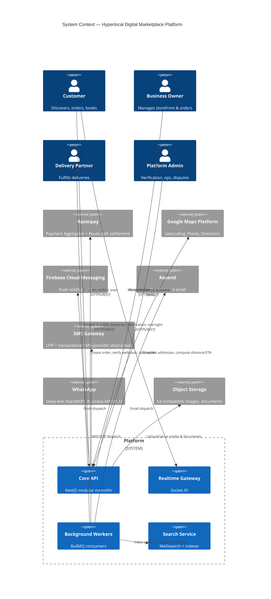
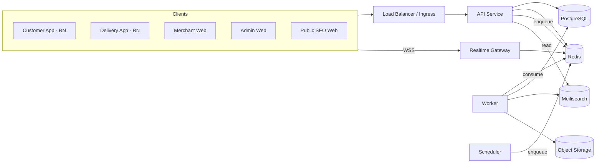

# System Architecture Document

## Hyperlocal Digital Marketplace Platform

| | |
|---|---|
| **Owner** | Arutech Consultancy Services LLP |
| **Status** | Draft v1.0 — pending stakeholder approval |
| **Date** | 2026-07-11 |
| **Phase** | 2 of 10 |
| **Input** | [Phase 1 PRD](../01-product-requirements/PRD.md) |
| **Next phase** | Database Design (blocked until this doc is approved) |

Cloud target: **cloud-agnostic** (stakeholder decision, 2026-07-11) — every infrastructure choice below is made to run identically on AWS, GCP, or Azure via Kubernetes and S3-compatible/managed-Postgres abstractions, with the provider decision deferred to Phase 10.

---

## Table of Contents

1. [Architecture Goals & Constraints](#1-architecture-goals--constraints)
2. [System Context](#2-system-context)
3. [Service Decomposition & Deployment Topology](#3-service-decomposition--deployment-topology)
4. [Client Applications](#4-client-applications)
5. [Clean Architecture Inside the API Service](#5-clean-architecture-inside-the-api-service)
6. [Domain / Bounded Context Map](#6-domain--bounded-context-map)
7. [Data Architecture](#7-data-architecture)
8. [API Architecture](#8-api-architecture)
9. [AuthN / AuthZ Architecture](#9-authn--authz-architecture)
10. [Payments Architecture](#10-payments-architecture)
11. [Search & Discovery Architecture](#11-search--discovery-architecture)
12. [Notifications Architecture](#12-notifications-architecture)
13. [Background Jobs & Event Flow](#13-background-jobs--event-flow)
14. [Realtime Architecture](#14-realtime-architecture)
15. [Caching Strategy](#15-caching-strategy)
16. [Observability](#16-observability)
17. [Security Architecture](#17-security-architecture)
18. [Multi-Tenancy / City Scoping](#18-multi-tenancy--city-scoping)
19. [AI Module Placement](#19-ai-module-placement)
20. [Monorepo Strategy](#20-monorepo-strategy)
21. [Infrastructure & Deployment](#21-infrastructure--deployment)
22. [Scalability Path](#22-scalability-path)
23. [NFR Traceability](#23-nfr-traceability)
24. [Architecture Decision Records](#24-architecture-decision-records)
25. [Open Questions](#25-open-questions)

---

## 1. Architecture Goals & Constraints

Carried forward from the PRD, these are the constraints every decision below is optimized against:

- **Single-city MVP**, architected so multi-city (V2) is a config/data change, not a rewrite ([§18](#18-multi-tenancy--city-scoping)).
- **Model A (cart/checkout) at full depth; Model B (booking) as directory + enquiry** at MVP, full slot-booking engine added in V1.1 without restructuring the Business/Catalog domain.
- **Four client surfaces at MVP**: native customer app, native delivery-partner app, web merchant dashboard, web admin panel — plus a recommended fifth (public SEO web) addressed in [§4](#4-client-applications).
- **Small initial engineering team, large eventual scale.** The architecture must not force premature distributed-systems overhead (service mesh, sagas, per-service databases) on a team that doesn't need it yet — but must not paint the team into a corner either. This tension is the throughline for [§24](#24-architecture-decision-records).
- **Cloud-agnostic** infrastructure per stakeholder decision.

---

## 2. System Context



---

## 3. Service Decomposition & Deployment Topology

**Decision: modular monolith, not microservices, at MVP.** ([ADR-001](#adr-001-modular-monolith-over-microservices))

Five independently-deployable units, all built from one NestJS/TypeScript codebase in the monorepo, sharing the domain/application layers but scaled and operated separately:

| Unit | Responsibility | Scaling driver |
|---|---|---|
| **API** | Synchronous REST endpoints for all four client types (customer, merchant, delivery, admin) | Request volume — horizontal pods behind a load balancer |
| **Realtime Gateway** | Socket.IO — order status, delivery live-location, in-app chat | Concurrent connections; uses Redis adapter so any pod can serve any client ([§14](#14-realtime-architecture)) |
| **Worker** | BullMQ consumers — notifications, search indexing, payout reconciliation, image processing, report rollups | Queue depth — scales independently of API traffic |
| **Search Indexer** | Thin consumer translating domain events into Meilisearch upserts (logically part of Worker, called out separately because it's the first thing likely to be extracted to its own service post-MVP) | Catalog write volume |
| **Scheduler** | Cron-style jobs (settlement batches, stale-order cleanup, subscription renewals) — a single-replica BullMQ repeatable-job producer | Time, not load |

All five units talk to the same PostgreSQL primary and Redis instance at MVP. Because every module's persistence access goes through its own repository implementation ([§5](#5-clean-architecture-inside-the-api-service)), splitting any one bounded context into its own service+database later is a mechanical extraction, not a redesign.



---

## 4. Client Applications

| App | Users | Stack | Notes |
|---|---|---|---|
| Customer App | Customers | **React Native** | Confirmed native, MVP ([PRD §16](../01-product-requirements/PRD.md#16-open-decisions-requiring-stakeholder-input)) |
| Delivery Partner App | Delivery partners | **React Native** | Shares RN infra/components with Customer App via `packages/` |
| Merchant Dashboard | Business owners/staff | **Next.js** (web, responsive) | Dense CRUD/data workflows — poor native fit, per PRD |
| Admin Panel | Internal ops | **Next.js** (web, responsive) | Same rationale |
| Public Web *(recommended addition)* | Prospective customers, search engines | **Next.js** (SSR/SSG) | See below |

**Recommendation: add a lightweight public, SEO-indexable web app** — city/category landing pages and business profile pages, server-rendered for search engine discovery, with an "Open in App" deep link / smart banner for any transactional action (cart, booking, chat). This is not scope creep: the PRD's own discovery requirements (search by shop/product/category/PIN, map search) are far more valuable as organic Google-indexed pages than as content locked inside a native app with zero day-one App Store ranking. It reuses the same Next.js investment already committed to for the merchant/admin apps and costs one additional deployable, not a new stack. If this isn't wanted, cut it — nothing else in this document depends on it. *(Flagging for your call; proceeding with it included unless you say otherwise.)*

All four/five clients consume the **same REST API** — no separate mobile-only backend-for-frontend at MVP. If payload-shaping needs diverge significantly (e.g., a heavier merchant dashboard payload vs. a lean mobile one), that's a `?fields=` sparse-fieldset convention on existing endpoints, not a second API to maintain ([ADR-006](#adr-006-rest--openapi-over-graphql-for-mvp)).

---

## 5. Clean Architecture Inside the API Service

Each bounded-context module ([§6](#6-domain--bounded-context-map)) follows the same four-layer internal structure, enforced by lint rule (no cross-layer import violations) rather than convention alone:

```
modules/business/
  domain/            # Entities, value objects, domain events, repository INTERFACES (ports)
    entities/
    events/
    repositories/    # e.g. BusinessRepository (interface only — no Prisma here)
  application/        # Use cases / application services, DTOs, orchestration
    use-cases/         # e.g. CreateBusinessUseCase, VerifyBusinessUseCase
    dto/
  infrastructure/     # Adapters — implements domain interfaces
    persistence/       # PrismaBusinessRepository implements BusinessRepository
    external/           # e.g. GoogleGeocodingAdapter
  presentation/        # Controllers, guards, pipes, OpenAPI decorators
    business.controller.ts
  business.module.ts   # NestJS DI wiring: binds interface -> implementation
```

**Rules:**
- `domain/` has zero framework/library imports (no NestJS decorators, no Prisma types) — it is pure TypeScript business logic, trivially unit-testable and portable if the framework ever changes.
- `application/` depends only on `domain/` interfaces, never on `infrastructure/` concrete classes — dependency inversion enforced via NestJS's DI container binding an interface token to a concrete provider.
- `presentation/` (controllers) depend only on `application/` use cases — controllers never touch Prisma or repositories directly.
- Cross-module communication happens through **domain events** (in-process `EventEmitter2` at MVP, swappable for a message broker later without touching domain code — see [ADR-009](#adr-009-bullmq--redis-for-async-work)), not direct service-to-service method calls, to keep modules decoupled enough to extract later.

This is the mechanism that makes [ADR-001](#adr-001-modular-monolith-over-microservices) safe: the "modular" in modular monolith isn't a folder convention, it's an enforced dependency direction.

---

## 6. Domain / Bounded Context Map

| Module | Owns | Model A/B relevance |
|---|---|---|
| **Identity** | Users, auth credentials, sessions, OAuth links, RBAC roles/permissions, staff accounts | Both |
| **Business & Catalog** | Businesses, categories, products, variants, inventory, services, opening hours, media | Both |
| **Commerce** | Cart, orders, order line items, coupons, taxes, delivery/platform fee computation | Model A |
| **Booking** | Service requests/enquiries (MVP); slot calendars, staff assignment, no-show policy (V1.1) | Model B |
| **Payments** | Payment transactions, refunds, invoices, merchant payout ledger | Both |
| **Delivery** | Delivery partners, assignment/matching, live tracking, OTP handoff, earnings | Model A (+ V1.1 dispatch for Model B) |
| **Reviews** | Ratings, reviews, moderation, verified-business badge | Both |
| **Notifications** | Templates, dispatch log, per-user channel preference | Both |
| **Search** | Read-projection sync into Meilisearch (owns no source-of-truth data) | Both |
| **Admin/Ops** | Verification queues, disputes, support tickets, audit log, CMS, featured listings (V1.1) | Both |
| **Analytics** | Pre-aggregated sales/revenue rollups | Both |
| **AI** *(stub only)* | Interface boundary for future recommendation/forecast/chat providers | Future |

Module boundaries mirror the PRD's persona/feature groupings deliberately — Phase 3 (database) and Phase 4 (API) inherit this map directly rather than re-deriving it.

---

## 7. Data Architecture

- **System of record:** single PostgreSQL database (Prisma ORM), one schema at MVP, tables namespaced by module ownership convention (only that module's repository writes its tables) — see [ADR-003](#adr-003-postgresql--prisma-as-system-of-record).
- **Geo data:** PostGIS extension enabled on Postgres from day one for authoritative geo business logic — delivery-radius/zone containment (`ST_DWithin`, polygon checks), distinct from Meilisearch's role.
- **Search index:** Meilisearch holds a **derived, eventually-consistent read projection** of businesses/products/services for fast fuzzy + geo-radius search. Postgres is always the source of truth; Meilisearch can be rebuilt from it at any time (full reindex job exists from MVP, not bolted on later).
- **Cache:** Redis — hot-read cache, session/rate-limit state, BullMQ backing store, distributed locks ([§15](#15-caching-strategy)).
- **Object storage:** S3-compatible interface (`StoragePort`) — default target Cloudflare R2 for zero egress cost on an image-heavy catalog app, works identically against AWS S3/GCS-via-interop/MinIO given the cloud-agnostic decision ([ADR-012](#adr-012-object-storage-abstraction)).
- **Two distinct geo use cases, two distinct tools** — worth stating explicitly since it's a common source of confusion: PostGIS answers *"is this address within this business's delivery zone"* (authoritative, used at checkout); Meilisearch answers *"what's near me"* (fast, fuzzy, used in search/browse). Don't conflate them.

Full ERD and table-level design is Phase 3's deliverable; this section fixes the storage technologies Phase 3 designs against.

---

## 8. API Architecture

- **REST + OpenAPI** as the single contract (`@nestjs/swagger` generating the spec from decorated controllers — spec is generated from code, not hand-maintained separately, to prevent drift). GraphQL deferred ([ADR-006](#adr-006-rest--openapi-over-graphql-for-mvp)).
- **Versioning:** URI-based (`/api/v1/...`) from the first commit — free to add later is a myth; retrofitting versioning onto an unversioned API already integrated by four client apps is expensive.
- **Pagination:** cursor-based for high-growth lists (catalog, orders, feed-style endpoints) rather than offset — offset pagination degrades under concurrent writes and at scale (page drift, slow `OFFSET` scans); page-number UI (admin panel) can be built on top of a cursor API without difficulty.
- **Filtering/sorting:** a documented, consistent query-param convention (`filter[field]=`, `sort=-createdAt`) applied uniformly rather than ad hoc per endpoint.
- **Rate limiting:** Redis-backed sliding window, global default + stricter per-endpoint overrides on auth/OTP endpoints (brute-force/SMS-pumping prevention — a real cost risk, not just a security nicety).
- **Validation:** class-validator DTOs at the presentation layer (NestJS-native, pairs with `@nestjs/swagger`); the equivalent Zod schemas used client-side (per PRD tech stack) are generated from/kept in sync with the same OpenAPI spec via a shared `packages/api-types` package, not hand-duplicated in two places ([§20](#20-monorepo-strategy)).
- **Idempotency:** required on all money-moving and state-transition POST endpoints (order creation, payment capture, order-accept) via an `Idempotency-Key` header, checked against a short-lived Redis record — prevents duplicate orders/charges on client retry, a real failure mode on flaky mobile networks.

---

## 9. AuthN / AuthZ Architecture

- **Tokens:** short-lived JWT access token (~15 min) + rotating refresh token. Refresh rotation includes **reuse detection**: if a refresh token is presented twice, every session for that user is invalidated and re-auth is forced — this is the standard defense against a stolen-refresh-token replay and is non-negotiable for a payments-adjacent product.
- **Storage:** web dashboards (merchant/admin) use httpOnly secure cookies for the refresh token (CSRF-protected via double-submit token, since cookies are involved); native apps use platform secure storage (iOS Keychain / Android Keystore) for the refresh token, bearer header for the access token — no CSRF exposure there since there's no ambient cookie auth.
- **OTP:** mobile OTP via the SMS abstraction ([§12](#12-notifications-architecture)), rate-limited per number and per IP, codes hashed at rest (never stored plaintext), short TTL, max-attempt lockout.
- **OAuth:** Google via OIDC at MVP; Apple Sign-In deferred (PRD).
- **RBAC:** roles and permissions are data (`roles`, `permissions`, `role_permissions` tables), not hardcoded enums, so Admin can define new scoped roles (e.g., a future city-scoped ops role, [§18](#18-multi-tenancy--city-scoping)) without a deploy. Enforced via a NestJS guard reading the caller's resolved permission set — checked at the presentation layer, never assumed at the application layer.
- **Four distinct auth "realms"** (customer, merchant/staff, delivery partner, admin) share the Identity module's token machinery but have non-overlapping permission scopes — a customer JWT is structurally incapable of hitting a merchant-scoped endpoint, not just UI-hidden.
- **Audit:** every admin and financial-mutation action is written to an append-only `audit_log` (actor, action, entity, before/after diff, timestamp, IP) — a Should-have promoted to Must-have at MVP in the PRD given verification/financial stakes.

---

## 10. Payments Architecture

- **Aggregator:** Razorpay as the RBI-authorized Payment Aggregator ([PRD §11](../01-product-requirements/PRD.md#11-compliance--regulatory-india)) — the platform never directly custodies card/bank data.
- **Checkout flow:** server creates a Razorpay Order (authoritative amount, computed server-side from cart — **never trust a client-submitted amount**), client completes payment via Razorpay Checkout SDK, and the order is confirmed **only** on a verified server-to-server webhook (signature-validated) — not on the client-side success callback alone, which is spoofable/droppable on a flaky connection.
- **Split settlement:** Razorpay Route with merchant-linked accounts (created during merchant bank/UPI KYC onboarding) — commission is auto-deducted and the remainder auto-transferred to the merchant, keeping the platform out of the business of custodying and manually disbursing merchant funds (materially reduces both engineering surface and regulatory exposure vs. building a manual payout system).
- **COD:** no online capture; a `cash_collection` record is created at order placement, marked collected by the delivery partner (OTP-gated handoff doubles as the collection-confirmation event), and reconciled against delivery-partner remittance in a scheduled batch job.
- **Refunds:** merchant/admin-initiated, processed async via Razorpay's Refund API by a worker job, confirmed by webhook, ledger updated on confirmation — never marked refunded optimistically before the aggregator confirms it.
- **Ledger design:** an **append-only `payment_transactions` table**, not a mutable running-balance column. Any "current balance" (merchant payout balance, delivery partner earnings) is a derived aggregate (`SUM()` over transactions, or a materialized/cached rollup invalidated on new transactions) rather than a column that gets directly incremented/decremented — eliminates an entire class of race-condition and audit-trail bugs common in naive wallet implementations.
- **Invoicing:** GST-compliant invoice generated server-side per order (PRD §11), stored in object storage, linked from order history.

---

## 11. Search & Discovery Architecture

- **Meilisearch**, not Elasticsearch, for MVP ([ADR-005](#adr-005-meilisearch-over-elasticsearch)).
- **Indexing is asynchronous**, never on the request path: a domain event (`ProductUpdated`, `BusinessVerified`, `StockChanged`, etc.) is emitted on write, a BullMQ consumer (the Search Indexer unit, [§3](#3-service-decomposition--deployment-topology)) upserts the corresponding Meilisearch document. Search is eventually consistent (sub-second in practice) in exchange for zero search-engine latency/failure coupling on the write path — the right trade for a catalog-search use case (not for, say, inventory-count correctness at checkout, which reads Postgres directly).
- **Geo-radius search** uses Meilisearch's native `_geo` filtering on indexed lat/lng; **delivery-eligibility** (can this specific address actually be served by this business) is re-validated against PostGIS at cart/checkout time as the authoritative check — search results are a fast approximation, checkout is the source of truth.
- **Full reindex** job exists from day one (not an afterthought) so the search index can always be rebuilt from Postgres — treats the index as disposable/derived, never as a second source of truth.

---

## 12. Notifications Architecture

- A `NotificationPort` interface with channel adapters: `PushAdapter` (Firebase FCM), `EmailAdapter` (Resend), `SmsAdapter` (provider-abstracted — e.g., swappable between MSG91/Twilio without touching call sites), `InAppAdapter` (DB-backed notification center + realtime badge push via [§14](#14-realtime-architecture)).
- **Event-driven fan-out:** domain events → a Worker-consumed `NotificationDispatcher` → renders a template → routes to the channel(s) appropriate for that notification's criticality and the user's preferences (OTP is always SMS and bypasses preference toggles; order-status is push+in-app; marketing is email and opt-in only).
- **Delivery guarantee:** at-least-once via queue retry with backoff; a dead-letter queue after N failed attempts, alerted to ops rather than silently dropped — a missed "order accepted" push is a direct hit to the fulfillment-rate metric in the PRD.
- Templates are locale-ready (parameterized strings) even though only English ships at MVP, per PRD localization scope.

---

## 13. Background Jobs & Event Flow

BullMQ queues (Redis-backed), each independently scalable/monitorable:

| Queue | Trigger | Consumer |
|---|---|---|
| `notifications` | Any domain event requiring user notification | Worker → NotificationDispatcher |
| `search-index` | Catalog/business write events | Search Indexer |
| `image-processing` | Media upload | Worker → resize/optimize/store variants |
| `payout-settlement` | Scheduled + order-delivered events | Scheduler/Worker → Razorpay Route |
| `cod-reconciliation` | Delivery-partner remittance | Worker |
| `report-rollup` | Scheduled (hourly/daily) | Worker → pre-aggregates merchant/admin dashboards |
| `stale-order-cleanup` | Scheduled | Worker → auto-cancel unaccepted orders past SLA |

Internal cross-module communication uses an **in-process event emitter at MVP** (`@nestjs/event-emitter`), with handlers already written against an interface shape compatible with a real broker (Redis Streams/BullMQ pub-sub already used for jobs, so no new infra is needed even when this is promoted) — deferring "real" message-broker infrastructure until a module actually needs to be extracted to its own deployable ([ADR-009](#adr-009-bullmq--redis-for-async-work)).

---

## 14. Realtime Architecture

- **Socket.IO**, per the PRD tech stack, with the **Redis adapter mandatorily enabled from MVP** — without it, a client connected to pod A never receives an event emitted from pod B, which silently breaks the moment the Realtime Gateway scales past one replica. This is easy to omit in a single-instance dev setup and only surfaces in production under load, so it's called out explicitly here rather than left as a Phase 7 implementation detail.
- **Rooms:** `order:{orderId}` (status + delivery chat), `delivery:{partnerId}` (live location ping), `business:{businessId}` (merchant live order feed) — scoped joins authorized against the same JWT used for REST, not a separate realtime-only auth scheme.
- Location pings are throttled (e.g., max 1 per 5s per rider) both to control cost and because sub-5-second precision has no product value here.

---

## 15. Caching Strategy

Redis serves five distinct purposes — worth enumerating since conflating them under "just use Redis" is how cache invalidation bugs happen:

1. **Session/refresh-token state** (reuse-detection set, §9).
2. **Rate limiting** (sliding-window counters, §8).
3. **Hot-read cache-aside**: business profile, category tree, homepage/city landing content. TTL-bounded **and** explicitly busted on the relevant write's domain event — TTL alone is not sufficient for data users will notice is stale (e.g., a merchant marking themselves closed should reflect within seconds, not wait out a 5-minute TTL).
4. **BullMQ backing store** (§13).
5. **Distributed locks** for race-prone critical sections — the canonical example being two delivery partners tapping "Accept" on the same order within the same second; a Redis `SET NX` lock (or `Redlock` if Redis is ever clustered) ensures exactly one wins, with the loser getting an immediate "already accepted" response rather than a silent double-assignment resolved later.

---

## 16. Observability

- **Logging:** structured JSON (pino), a request/correlation ID generated at the edge and propagated through every log line and downstream service call (including into queue jobs) so a single user-reported issue can be traced across the API → worker → external-webhook chain.
- **Tracing:** OpenTelemetry instrumentation from MVP (low marginal cost to add now vs. retrofitting), exported to any OTLP-compatible backend — kept vendor-agnostic consistent with the cloud-agnostic decision.
- **Metrics:** Prometheus-format `/metrics` endpoint on API/Worker/Realtime, visualized in Grafana — request latency percentiles, queue depth/age, webhook failure rate, and the PRD's own business metrics (order fulfillment rate, cancellation rate) surfaced as first-class dashboards, not just infra metrics.
- **Error tracking:** Sentry (or equivalent) across all five backend units and both web frontends; source maps uploaded in CI so native-app and web stack traces are readable in production.
- **Alerting** on: webhook signature failures, dead-letter queue growth, p95 latency breach, and payout-settlement job failures — these four map directly to the PRD's fulfillment-rate and financial-integrity risk areas.

---

## 17. Security Architecture

- Helmet + strict CORS allowlist per client origin (four distinct known origins, no wildcard).
- Rate limiting as in [§8](#8-api-architecture), with materially stricter limits on `/auth/*` and `/otp/*`.
- Validation at every presentation-layer boundary (class-validator DTOs); Prisma parameterizes all queries by construction (no raw string-interpolated SQL — enforced by lint rule banning `$queryRawUnsafe`).
- CSRF protection on cookie-based web-dashboard sessions only (double-submit cookie pattern); not applicable to bearer-token mobile/API auth.
- **Secrets management:** never `.env` files outside local dev — a secrets manager (cloud-native or a portable option like Doppler/Infisical, chosen at Phase 10 alongside the cloud provider) injects secrets at deploy time; nothing sensitive is baked into container images or committed to the repo (enforced via a pre-commit secret-scanning hook).
- **Encryption:** managed-Postgres encryption at rest for the whole database, plus **field-level envelope encryption** for the highest-sensitivity columns specifically (bank account numbers, GST/PAN document references) — defense in depth beyond whole-disk encryption for the fields that matter most if the database itself is ever exposed.
- **RBAC enforcement** at the guard layer for every admin/merchant-staff endpoint — never inferred from "the UI doesn't show that button."
- **Audit log** (§9) as the forensic backbone for any dispute, chargeback, or verification-fraud investigation.

---

## 18. Multi-Tenancy / City Scoping

**Recommendation: add `city_id` (and a `regions` table) to the schema from MVP, even though only one city launches.** ([ADR-004](#adr-004-logical-multi-tenancy-from-day-one))

This is the single cheapest insurance policy in this document. A `city_id` foreign key on `businesses` (with orders/delivery scoped transitively through their business) costs nothing at single-city scale — every query just has one constant value to filter by, which can even be a no-op filter at MVP. Retrofitting tenant scoping onto a live production database with real orders and financial records in V2 is a genuinely risky migration (backfilling a NOT NULL FK across every related table, rewriting every unscoped query, re-auditing RBAC for tenant leakage) attempted under the pressure of an active expansion deadline. The admin RBAC model ([§9](#9-authn--authz-architecture)) is likewise designed to support a `city`-scoped role from day one, even though the only role exercised at MVP is the unscoped super-admin.

This is **not** full data-isolation multi-tenancy (no separate schemas/databases per city) — just a logical partition key threaded through the schema and query layer, appropriate for a single shared-database marketplace where cross-city analytics/admin will always be needed anyway.

---

## 19. AI Module Placement

Per the PRD, no AI feature ships at MVP — but the module boundary is designed now so V1.1/V2 AI features (recommendations, demand forecasting, chat assistant, voice/image search, OCR) slot in without touching commerce/catalog code:

- An `AiPort` interface family (`RecommendationPort`, `ForecastPort`, `AssistantPort`) lives in the shared domain layer from MVP, with **no implementation** behind it yet — call sites that will eventually want AI (e.g., "related products" on a product page) are either omitted entirely at MVP or backed by a trivial non-AI heuristic (e.g., "same category, same business") behind the same interface, so swapping in a real model later changes one binding, not every call site.
- The eventual implementation is expected to be a **separate deployable** (likely Python/FastAPI, given the ML/data-science tooling ecosystem) called over an internal API — kept out of the NestJS monolith so model-serving dependencies (GPU requirements, Python ML libraries) never bloat or destabilize the core commerce service.

---

## 20. Monorepo Strategy

**Turborepo** ([ADR-002](#adr-002-monorepo-turborepo)), structured (full detail in Phase 6):

```
apps/
  api/                 # NestJS API service
  worker/               # BullMQ consumers (Worker + Search Indexer + Scheduler)
  realtime/              # Socket.IO gateway
  web-merchant/            # Next.js
  web-admin/                # Next.js
  web-public/                 # Next.js (SEO, §4)
  mobile-customer/              # React Native
  mobile-delivery/                # React Native
packages/
  domain-types/          # Shared TS types/enums mirrored from Prisma schema
  api-client/              # Generated typed client from the OpenAPI spec
  validation-schemas/        # Zod schemas kept in sync with backend DTOs
  ui/                           # Shared design-system components (web)
  ui-native/                      # Shared design-system components (RN)
  config/                           # Shared ESLint/TSConfig/Prettier base
```

The point of the monorepo isn't organizational tidiness — it's that `api-client` and `validation-schemas` being real shared packages (not copy-pasted per app) is what prevents the four/five clients from drifting out of sync with the API contract as the platform grows.

---

## 21. Infrastructure & Deployment

- **Local dev:** Docker Compose (Postgres+PostGIS, Redis, Meilisearch, MinIO as an S3-compatible local stand-in) — one command to a working full stack.
- **Staging/prod target: Kubernetes**, specifically *because* it's the one orchestration abstraction that's genuinely portable across AWS/GCP/Azure (EKS/GKE/AKS) or self-hosted (k3s) — the natural fit for the cloud-agnostic decision, and directly satisfies the brief's "Kubernetes Ready" requirement rather than deferring it. Deployment artifacts are Helm charts per unit (`api`, `worker`, `realtime`), not raw manifests, for environment templating (dev/staging/prod value overrides).
- **Database:** managed Postgres+PostGIS where the eventual provider offers it (RDS/Cloud SQL/Azure Database for PostgreSQL), or a self-hosted CloudNativePG operator on the same cluster for a fully agnostic/lower-cost path — both are viable against this architecture; the choice is deferred to Phase 10 alongside the provider decision.
- **CI/CD:** GitHub Actions — lint → typecheck → unit tests → build container images → push to a registry (GHCR, provider-agnostic) → integration tests against ephemeral Compose stack → deploy to staging → smoke test → manual promotion to prod. Full pipeline definitions are Phase 9/10 deliverables; this fixes the shape now so Phase 6's folder structure supports it.
- **Ingress/edge:** NGINX ingress controller (or cloud LB equivalent) + CDN in front of `web-public`/`web-merchant`/`web-admin` and object storage for image delivery.

---

## 22. Scalability Path

Deliberately sequenced — do the cheap/high-leverage things first, add operational complexity only when a real bottleneck justifies it:

1. **Horizontal pod autoscaling** on API/Worker/Realtime (cheap, automatic, first lever).
2. **PgBouncer** connection pooling in front of Postgres (cheap, prevents connection-exhaustion at moderate scale).
3. **Postgres read replicas** for read-heavy paths (catalog browse, order history) once write contention on the primary becomes measurable.
4. **Redis cluster mode** once a single Redis instance's memory/throughput is the bottleneck (unlikely before multi-city).
5. **Meilisearch sharding** at large catalog scale (multi-city, most likely V2+ concern).
6. **Extract the first service out of the monolith** — Search Indexer and Notifications are the two best first candidates (already event-driven, already loosely coupled per [§5](#5-clean-architecture-inside-the-api-service)) — only once their resource profile genuinely diverges from the API service's (e.g., notification volume spikes independent of API traffic).

Steps 1–3 alone comfortably carry a multi-city, high-volume marketplace; steps 4–6 are the "millions of users" tier and are intentionally not pre-built — building them before they're needed is exactly the premature-microservices trap this architecture is designed to avoid ([ADR-001](#adr-001-modular-monolith-over-microservices)).

---

## 23. NFR Traceability

Mapping PRD non-functional requirements to the mechanism that satisfies them, so nothing in Phase 1 was silently dropped:

| PRD NFR | Architecture mechanism |
|---|---|
| p95 < 300ms reads / < 800ms writes | Redis cache-aside (§15), cursor pagination (§8), PgBouncer + read replicas at scale (§22) |
| 99.5% → 99.9% availability | Horizontally-scaled stateless units (§3), K8s self-healing, managed-Postgres automated failover |
| OWASP Top 10 | §17 in full |
| DPDPA compliance | Field-level encryption, audit log, consent capture at Identity module (detail in Phase 3 schema) |
| RPO ≤ 1h / RTO ≤ 4h | Managed-Postgres automated backups + PITR; documented restore runbook (Phase 10 deliverable) |
| Observability before GA | §16 — not deferred, built alongside Phase 7 |

---

## 24. Architecture Decision Records

### ADR-001: Modular Monolith over Microservices
**Context:** brief calls for clean/modular architecture and eventual million-user scale. **Decision:** one NestJS codebase, five deployable units (§3), strict internal module boundaries via Clean Architecture layering (§5) and event-driven cross-module communication (§13). **Alternative rejected:** full microservices per bounded context at MVP. **Why rejected:** distributed transactions, service mesh, per-service on-call burden, and network-latency-as-a-new-failure-mode are costs a pre-launch team pays with zero corresponding benefit — nothing at MVP scale needs independent per-service scaling. **Consequence:** module extraction later is mechanical (repository pattern + event-driven coupling already in place) precisely because this boundary discipline is enforced from day one, not because a rewrite is planned.

### ADR-002: Monorepo (Turborepo)
**Decision:** single repo, Turborepo task orchestration/caching. **Why:** five-plus apps sharing a real API contract (`api-client`, `validation-schemas` packages, §20) need atomic cross-app changes and zero contract drift; polyrepo trades that for an illusion of independence that a small team doesn't benefit from yet.

### ADR-003: PostgreSQL + Prisma as System of Record
**Decision:** one Postgres database (+ PostGIS), Prisma ORM, module-owned table conventions (§7). **Why over polyglot persistence:** the domain doesn't yet have a workload that outgrows relational modeling (orders, catalog, and payments are all inherently relational/transactional); adding a second database technology at MVP is complexity without a matching need.

### ADR-004: Logical Multi-Tenancy From Day One
See [§18](#18-multi-tenancy--city-scoping) in full — `city_id` scoping added now because retrofitting it onto a live financial dataset later is materially more expensive than the near-zero cost of including it now.

### ADR-005: Meilisearch over Elasticsearch
**Decision:** Meilisearch for catalog/business search. **Why:** comparable relevance/typo-tolerance and native geo-radius filtering for this use case, at a fraction of the operational overhead (no JVM tuning, no cluster/shard management burden) appropriate for a small ops team. **Revisit when:** search needs grow into heavy analytical aggregations Meilisearch doesn't support — the read-projection design (§11) makes that migration a reindex, not a rewrite, since Postgres remains the source of truth either way.

### ADR-006: REST + OpenAPI over GraphQL for MVP
**Decision:** REST is the sole API paradigm at MVP; GraphQL deferred indefinitely pending real need. **Why:** OpenAPI-generated typed clients (§20) already solve the main problem GraphQL is usually reached for (client-server type safety); maintaining two API paradigms (two auth layers, two rate-limiting strategies, two sets of tests) is real ongoing cost for a benefit (flexible client-driven querying) none of the four/five known clients currently need.

### ADR-007: React Native for Customer & Delivery-Partner Apps
**Decision:** React Native, not separate Swift/Kotlin codebases. **Why:** maximizes logic/type-sharing with the existing TypeScript stack (shared `validation-schemas`, `api-client`, and even some UI primitives via `ui-native`), and one codebase covering two platforms matters more than platform-specific polish at this stage. **Noted exception:** delivery-partner background location/navigation may need a thin native module if RN's background-location APIs prove insufficient — a Phase 7 implementation detail, not an architecture blocker.

### ADR-008: Razorpay as Payment Aggregator, with Route for Split Settlement
See [§10](#10-payments-architecture) in full. **Why over building custom settlement:** RBI-authorized PA status is a regulatory requirement, not a preference (PRD §11); Route's linked-account split-settlement removes the platform from directly custodying and manually disbursing merchant funds, reducing both engineering surface and regulatory exposure simultaneously.

### ADR-009: BullMQ + Redis for Async Work
**Decision:** BullMQ (already Redis-backed, already required for caching/rate-limiting/locks) handles both background jobs (§13) and, via an in-process event emitter today, the seam for future cross-module eventing. **Why not a dedicated broker (Kafka/RabbitMQ/SQS) at MVP:** would be a second piece of infrastructure solving a problem Redis/BullMQ already solves at this scale — revisit only if a specific extracted service needs guarantees BullMQ can't provide (e.g., strict ordering across partitions).

### ADR-010: Kubernetes as the Deployment Target (Cloud-Agnostic)
**Decision:** Helm-charted Kubernetes deployment (§21), not a provider-specific serverless/container platform. **Why:** directly follows from the stakeholder's cloud-agnostic decision — Kubernetes is the one orchestration layer with genuinely equivalent managed offerings (EKS/GKE/AKS) across all three major clouds, and satisfies the brief's "Kubernetes Ready" requirement without deferring it to a future migration.

### ADR-011: Object Storage Abstraction
**Decision:** a `StoragePort` interface, defaulting to Cloudflare R2 (S3-API-compatible, zero egress fees — meaningful for an image-heavy catalog app) but swappable to AWS S3/GCS/MinIO without touching call sites. **Why default R2 despite being cloud-agnostic on compute:** object storage and compute provider don't have to match, and egress cost for a media-heavy app compounds fast at scale — worth deciding independently.

### ADR-012: Secrets Management
**Decision:** no secrets in `.env` files or images outside local dev; a portable secrets manager (Doppler/Infisical, or the eventual cloud provider's native service via the same interface) injects at deploy time, enforced by a pre-commit secret-scanning hook repo-wide from day one.

---

## 25. Open Questions

None block Phase 3. Two items carried forward for later phases:
- **Public SEO web app ([§4](#4-client-applications))** — proceeding with it included in the architecture; flag if you'd rather cut it.
- **Final cloud provider** — deferred to Phase 10 by design; does not block database/API/UI/backend/frontend phases since everything above is built provider-agnostic.

---

**Status:** Ready for review. Phase 3 (Database Design) will produce the full ERD against the storage decisions in [§7](#7-data-architecture) and the bounded-context map in [§6](#6-domain--bounded-context-map).
