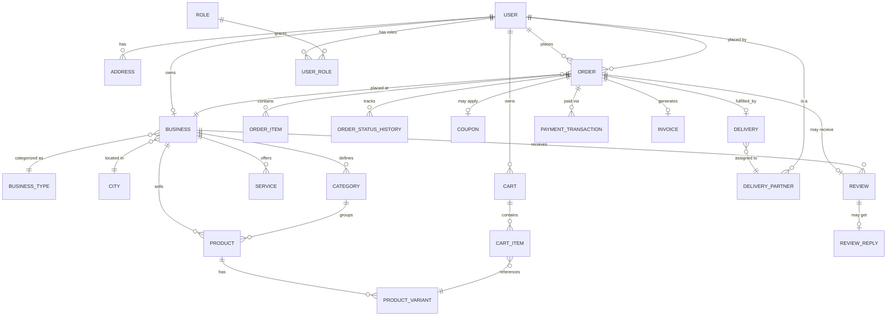

# Database Design

## Hyperlocal Digital Marketplace Platform

| | |
|---|---|
| **Owner** | Arutech Consultancy Services LLP |
| **Status** | Draft v1.0 — pending stakeholder approval |
| **Date** | 2026-07-11 |
| **Phase** | 3 of 10 |
| **Input** | [PRD](../01-product-requirements/PRD.md), [Architecture §6/§7](../02-architecture/ARCHITECTURE.md#6-domain--bounded-context-map) |
| **Companion artifact** | [schema.prisma](schema.prisma) — the concrete, literal schema this document explains |
| **Next phase** | API Design (blocked until this doc is approved) |

This document explains the *why* behind [schema.prisma](schema.prisma). Read them together: this doc for rationale and trade-offs, the schema for exact fields/types/constraints. Table names below are written as they appear in the schema (PascalCase model name, `snake_case` DB table via `@@map`).

---

## Table of Contents

1. [Design Conventions](#1-design-conventions)
2. [Entity-Relationship Overview](#2-entity-relationship-overview)
3. [Schema by Bounded Context](#3-schema-by-bounded-context)
4. [Key Design Decisions](#4-key-design-decisions)
5. [Indexing Strategy](#5-indexing-strategy)
6. [Data Integrity Rules Not Enforceable by the DB](#6-data-integrity-rules-not-enforceable-by-the-db)
7. [Migration & Seeding Strategy](#7-migration--seeding-strategy)
8. [V1.1+/V2-Reserved Schema](#8-v11v2-reserved-schema)
9. [Open Questions](#9-open-questions)

---

## 1. Design Conventions

These apply uniformly across every table in [schema.prisma](schema.prisma); stated once here rather than repeated per table.

| Convention | Choice | Why |
|---|---|---|
| **Primary keys** | `UUID`, DB-generated (`gen_random_uuid()` via `pgcrypto`) | Avoids exposing sequential IDs (business/order enumeration is a real information-disclosure risk in a marketplace — competitors could scrape order volume from sequential IDs) and lets Delivery Partner/Customer apps generate client-side idempotency keys against the same ID space. **Trade-off accepted:** random UUIDv4 causes some B-tree index fragmentation vs. sequential IDs; mitigated because every high-volume table (`Order`, `AuditLog`, `Notification`) is also indexed on `created_at` for its actual hot query pattern (range scans by time), so the PK index is rarely the bottleneck index. If a Postgres version with native UUIDv7 (time-ordered) becomes available before Phase 7 implementation, prefer it — same design, better index locality, revisit at implementation time rather than blocking this design on it. |
| **Money** | `Int`, smallest currency unit (paise), e.g. `total_paise` | Floating-point currency math is a correctness bug waiting to happen (`0.1 + 0.2 !== 0.3`); integer paise arithmetic is exact. All money columns are named `..._paise` so this convention is self-documenting at the call site, not just in this doc. |
| **Timestamps** | `TIMESTAMPTZ`, `createdAt` default `now()`, `updatedAt` auto-managed | Timezone-aware storage even though MVP is India-only — costs nothing now, and "we stored naive timestamps and don't know what timezone" is a genuinely painful retrofit. |
| **Soft delete** | `deletedAt TIMESTAMPTZ?` on entities a user/business can "delete" but that are referenced by historical records (`User`, `Business`, `Product`, `Address`) | An order must remain fully readable after the product it contained is discontinued or the business closes. Hard-deleted rows would either cascade-delete order history (unacceptable) or leave dangling FKs (worse). Transactional/log tables (`Order`, `PaymentTransaction`, `AuditLog`) are never deletable at all — no `deletedAt`, by design. |
| **Historical accuracy** | `OrderItem` stores `nameSnapshot`, `unitPriceSnapshotPaise` etc. rather than only a live FK to `ProductVariant` | A product's price/name changing next week must not silently rewrite last week's invoice. This is the single most common correctness bug in naively-normalized e-commerce schemas — normalizing order line items down to "just a variant ID" looks cleaner on day one and produces wrong invoices by week three. |
| **Enums vs. lookup tables** | Fixed state machines (`OrderStatus`, `PaymentStatus`, `DeliveryStatus`) are native Postgres enums via Prisma `enum`. Anything admin-configurable (`BusinessType`, `Category`, `Role`, `Permission`) is a table with a FK, never an enum. | A state machine (`placed → accepted → ...`) is genuinely fixed at the domain level and benefits from DB-level validation. A business category list is explicitly something Admin needs to extend without a deploy (PRD Admin Panel: Category management) — an enum would force a migration for every new category. |
| **Multi-tenancy** | `cityId` on `Business`, denormalized onto `Order`/`Delivery`/`DeliveryPartner` | Per [Architecture ADR-004](../02-architecture/ARCHITECTURE.md#adr-004-logical-multi-tenancy-from-day-one) — cheap now, expensive to retrofit onto live financial data. Denormalizing `cityId` onto orders (not just reachable via a join through `Business`) means every city-scoped admin/analytics query is a direct indexed filter, not a join — this matters the moment a second city launches and someone builds a per-city ops dashboard. |
| **Naming** | Prisma models `PascalCase`, fields `camelCase`, DB tables/columns `snake_case` via `@@map`/`@map` | Idiomatic for each side of the ORM boundary — TypeScript code reads naturally, SQL/psql sessions read naturally, no jarring case mismatch in either. |
| **Staff = User + scoped role, not a parallel identity** | Merchant/admin "staff" are `User` rows with a `UserRole` scoped by `businessId`, not a separate `Staff` table | The PRD lists "Staff Management" as a feature, but a staff member logging in, resetting a password, or getting OTP'd is identical to any other user — modeling it as a second identity system would duplicate all of §9 auth architecture for no benefit. What's actually distinct about a staff member is *what they're authorized to do at which business*, which is exactly what `UserRole(userId, roleId, businessId)` expresses. |

---

## 2. Entity-Relationship Overview

Core commerce flow (Model A) — the highest-traffic path, shown in full; supporting contexts summarized in [§3](#3-schema-by-bounded-context).

Full field-level detail for every entity is in [schema.prisma](schema.prisma); this diagram exists to validate the *shape* of the design against the PRD's core user journeys (browse → cart → order → pay → deliver → review) before committing to exact columns.

---

## 3. Schema by Bounded Context

Mirrors [Architecture §6](../02-architecture/ARCHITECTURE.md#6-domain--bounded-context-map) exactly, so there's a 1:1 line from PRD feature → architecture module → schema table.

| Bounded Context | Tables |
|---|---|
| **Identity** | `User`, `OAuthAccount`, `RefreshToken`, `Role`, `Permission`, `RolePermission`, `UserRole`, `Address` |
| **Business & Catalog** | `City`, `BusinessType`, `Business`, `BusinessDocument`, `BusinessBankDetail`, `BusinessHour`, `BusinessMedia`, `Category`, `Product`, `ProductVariant`, `ProductImage`, `Service`, `ServiceImage` |
| **Commerce (Model A)** | `Cart`, `CartItem`, `Coupon`, `CouponRedemption`, `Order`, `OrderItem`, `OrderStatusHistory` |
| **Booking (Model B, MVP)** | `ServiceRequest` — deliberately the *only* Model B table at MVP; see [§4.2](#42-model-b-gets-one-table-at-mvp-not-a-booking-engine) |
| **Payments** | `PaymentTransaction`, `Invoice`, `CashCollection`, `MerchantPayoutBatch` |
| **Delivery** | `DeliveryPartner`, `DeliveryPartnerDocument`, `Delivery`, `DeliveryEarning` |
| **Reviews** | `Review`, `ReviewMedia`, `ReviewReply` |
| **Notifications** | `NotificationTemplate`, `Notification`, `NotificationPreference` |
| **Admin/Ops** | `SupportTicket`, `TicketMessage`, `Dispute`, `AuditLog` |
| **Analytics** | Materialized views (not Prisma-managed tables) — see [§4.6](#46-analytics-is-materialized-views-not-tables) |
| *(V1.1+/V2, reserved — [§8](#8-v11v2-reserved-schema))* | `SubscriptionPlan`, `BusinessSubscription`, `CmsPage`, `FeaturedListing`, `StaffCalendar`, `AppointmentSlot`, `Booking` |

---

## 4. Key Design Decisions

### 4.1 Ledgers, not balance columns

`PaymentTransaction` and `DeliveryEarning` are **append-only**. There is no `merchant.balance` or `delivery_partner.wallet_balance` column that gets directly incremented/decremented. Any "current balance" is `SUM(amount_paise)` over the relevant ledger (cached/materialized for read performance if needed, but never the write-path source of truth).

**Why:** a mutable balance column updated via `UPDATE ... SET balance = balance + X` is a well-known race-condition trap under concurrent writes (two simultaneous payouts can lose an update without careful locking) and destroys the audit trail the moment a bug corrects the number directly. An append-only ledger makes every money movement independently reconstructable and auditable — a hard requirement given this touches real settlement to real businesses (see [Architecture §10](../02-architecture/ARCHITECTURE.md#10-payments-architecture)).

### 4.2 Model B gets one table at MVP, not a booking engine

Per the approved PRD sequencing, appointment-based businesses (salons, clinics, consultants) get a lightweight `ServiceRequest` table at MVP (customer proposes a time, business confirms/declines manually) rather than a full slot/calendar engine. The full V1.1 booking engine (`StaffCalendar`, `AppointmentSlot`, `Booking`) is sketched in [§8](#8-v11v2-reserved-schema) but **not** part of the MVP migration — building it now would be exactly the kind of premature scope the PRD's sequencing call was meant to avoid.

### 4.3 Two separate taxonomies: `BusinessType` vs. `Category`

- **`BusinessType`** is a small, platform-owned, admin-managed list (~25 rows matching the PRD's business categories: Grocery, Salon, CA Office, etc.) with a `commerceModel` flag (`PRODUCT`/`SERVICE`). It answers *"what kind of business is this"* — used for discovery filtering ("show me nearby salons") and for deciding whether a business gets the Model A or Model B transactional surface.
- **`Category`** is per-business, self-referencing (unlimited depth via `parentId`), and answers *"how does this specific business organize its own catalog"* — a hardware store's categories (Plumbing, Electrical, Tools) share nothing structurally with a salon's (Hair, Skin, Spa), and the PRD explicitly asks for "Unlimited Categories" as a merchant feature, not a fixed platform taxonomy.

Conflating these into one table (as a first instinct might suggest) would force either a rigid platform-wide category list merchants can't customize, or a self-service taxonomy with no reliable way to filter "all grocery stores" — both wrong for different reasons.

### 4.4 Denormalized snapshots on `OrderItem`

Already covered in [§1](#1-design-conventions)'s conventions table — called out again here because it's the one place a reviewer's first instinct ("why store the name/price twice, just join to Product") is actively wrong for this domain. Historical financial records must not change when the product catalog changes.

### 4.5 Geo data lives in two places, on purpose

`Business`, `Address`, and `DeliveryPartner` each carry both plain `latitude`/`longitude` decimals (readable directly via Prisma Client, used for simple distance display) **and** a PostGIS `geography(Point, 4326)` column (`Unsupported` type in Prisma, populated via a DB trigger from lat/lng in a raw-SQL migration, queried via `$queryRaw` for `ST_DWithin`/polygon-containment checks). This mirrors [Architecture §7](../02-architecture/ARCHITECTURE.md#7-data-architecture): PostGIS is the authoritative "is this address in the delivery zone" check, Meilisearch (external to Postgres entirely, not a table here) handles fuzzy "what's near me" search. Prisma cannot natively express PostGIS geometry types or GIST-indexed spatial predicates, so the geography column is intentionally modeled as `Unsupported` and touched only through raw SQL/migrations — documented honestly here rather than glossed over.

### 4.6 Analytics is materialized views, not tables

The PRD's merchant/admin sales dashboards (daily/weekly/monthly revenue, top products) are **not** modeled as application-maintained rollup tables (e.g., a `daily_sales` row the app `UPSERT`s on every order). That pattern creates a second write path that can drift from the source of truth (`Order`/`OrderItem`) under any bug, retry, or backfill. Instead: Postgres materialized views (`business_sales_daily_mv`, etc.), refreshed on a schedule by the Worker's `report-rollup` queue ([Architecture §13](../02-architecture/ARCHITECTURE.md#13-background-jobs--event-flow)). Views are defined in a migration (SQL, not Prisma schema — Prisma can still read them via a `@@map`'d read-only model if the application needs typed access), always derivable from source tables, and never a second place a bug can silently corrupt reported revenue.

### 4.7 `Order.couponId` vs. `CouponRedemption` — denormalization with a stated reason

`Order` carries a direct `couponId` (fast, denormalized "which coupon applied to this order" for receipt display), while `CouponRedemption` is the actual source of truth used to enforce `perUserLimit`/`usageLimit` (`COUNT(*)` query, not a mutable counter — same ledger principle as [§4.1](#41-ledgers-not-balance-columns)). Both exist deliberately: one for cheap reads, one for correctness under concurrent redemption attempts.

### 4.8 `User.fullName` is nullable

**Amended during Phase 7 implementation** (2026-07-11): the field was originally required, but [API Design §5.1](../04-api-design/API_DESIGN.md#51-otp-verify--post-authotpverify)'s own OTP-verify flow creates a `User` record the moment a phone number is verified — before any name has been collected — and returns `"isNewUser": true` precisely so the client knows to prompt for profile completion afterward. A required `fullName` would have forced either a fake placeholder value at creation or a second, more complex "pending registration" table just to hold a phone number until a name arrives. Nullable is the honest representation of that real intermediate state; `application/use-cases/get-me.use-case.ts` in `@app/api` is the first caller that has to account for it (a `null` name is a legitimate value to render, not an error). This is the kind of small cross-phase gap that only surfaces once a design is actually implemented — noted here rather than silently patched so the schema and its rationale stay in sync.

---

## 5. Indexing Strategy

| Pattern | Index |
|---|---|
| "Orders for this business, by status, recent first" (merchant dashboard) | `Order(businessId, status, createdAt)` composite |
| "Orders for this customer, recent first" (order history) | `Order(userId, createdAt)` composite |
| "Businesses in this city, of this type" (discovery browse) | `Business(cityId, businessTypeId)` composite, plus `Business(verificationStatus)` partial for the admin verification queue |
| Geo-radius queries | GIST index on the PostGIS `geography` column ([§4.5](#45-geo-data-lives-in-two-places-on-purpose)) — not a B-tree, spatial indexes need `type: Gist` |
| Coupon usage-limit checks | `CouponRedemption(couponId, userId)` composite, backing the `COUNT(*)` enforcement query |
| Audit/log range scans | `AuditLog(entityType, entityId, createdAt)` and `AuditLog(actorUserId, createdAt)` — audit lookups are almost always "history for this entity" or "history for this actor" |
| Notification delivery worker | `Notification(status, createdAt)` partial index on `status = 'queued'` — the worker's poll query should never scan sent/read rows |
| Uniqueness | `(provider, providerAccountId)` on `OAuthAccount`; `slug` on `Business`/`Product`; `code` on `Coupon`; `orderNumber` on `Order`; `orderId` on `Delivery`/`Invoice` (1:1) |

Not partitioned at MVP — single-city order volume doesn't warrant it, and partitioning `Order`/`AuditLog` by `createdAt` range is a well-trodden migration path *later* precisely because nothing in the PK/index design above precludes it (no cross-partition unique constraints assumed). Consistent with [Architecture §22](../02-architecture/ARCHITECTURE.md#22-scalability-path)'s "cheap levers first" sequencing.

---

## 6. Data Integrity Rules Not Enforceable by the DB

Documented here so Phase 7 doesn't assume the schema alone guarantees them — these are application-layer invariants:

- `Category.parentId` must reference a category belonging to the **same** `businessId` (no cross-business category trees). Enforceable in Postgres only via a trigger; simpler and sufficient to enforce in the application service layer (`CategoryService`), matching the [Clean Architecture](../02-architecture/ARCHITECTURE.md#5-clean-architecture-inside-the-api-service) use-case boundary that already owns this validation.
- `ProductVariant.stockQuantity` decrements must happen inside the same DB transaction as `OrderItem` creation, using `SELECT ... FOR UPDATE` (or Prisma's optimistic-concurrency `updateMany` + rowcount check) to prevent overselling under concurrent checkout — a classic race condition if implemented naively as read-then-write.
- `Delivery.otpCode` is stored hashed; the plaintext OTP is generated, sent to the customer, and never persisted — the DB should never contain a value that alone allows delivery confirmation.
- Lightweight "who touched this" fields on minor admin actions (`BusinessDocument.reviewedBy`, `OrderStatusHistory.changedBy`) are stored as plain UUID columns, **not** full Prisma relations back to `User` — deliberately, to avoid `User` accumulating dozens of one-off back-relations for every low-stakes "reviewed/changed by" field. Contrast with `Dispute.raisedByUserId`/`resolvedBy` and `SupportTicket.assignedAdminId`, which **are** full relations, because disputes and tickets are exactly the records someone will need to query "show me everything Admin X touched" against — that access pattern justifies the relation; a document-review timestamp doesn't.
- One active `Cart` per `(userId, businessId)` — modeled as a DB unique constraint (`@@unique([userId, businessId])` where `status = ACTIVE`... Postgres partial unique index), so this one *is* DB-enforced; called out here to contrast with the ones above that aren't.

---

## 7. Migration & Seeding Strategy

- **Tool:** Prisma Migrate, migrations committed to the repo from the first one (`prisma/migrations/`), never `db push` against staging/prod.
- **Extensions migration:** the first migration enables `pgcrypto` (for `gen_random_uuid()`) and `postgis`, and creates the PostGIS `geography` generated columns + triggers + GIST indexes referenced in [§4.5](#45-geo-data-lives-in-two-places-on-purpose) as raw SQL (Prisma supports hand-authored SQL migrations alongside schema-driven ones).
- **Seed data required before the app is usable:** `BusinessType` (the ~25 PRD categories, each tagged `PRODUCT`/`SERVICE`), `Role`/`Permission`/`RolePermission` (the RBAC baseline from [Architecture §9](../02-architecture/ARCHITECTURE.md#9-authn--authz-architecture)), `City` (the single MVP launch city). A `prisma/seed.ts` script owns this, run automatically in CI for test environments and manually (once) for the first production deploy.
- **No destructive migrations against data that matters** without an explicit backfill step reviewed in the PR — standard practice, stated explicitly here because this schema will accumulate real financial/order history quickly after launch.

---

## 8. V1.1+/V2-Reserved Schema

Sketched now (shape only, not the full column-level design work of [§3](#3-schema-by-bounded-context)) so later additions are informed extensions of this design rather than a surprise, without spending Phase 3 effort building tables nothing will read for months:

- **`SubscriptionPlan` / `BusinessSubscription`** — merchant subscription tiers (PRD monetization, deferred to V1.1). Shape: plan catalog + a business's active subscription with `currentPeriodEnd`, billed via the same `PaymentTransaction` ledger with a `type = SUBSCRIPTION` addition.
- **`CmsPage` / `FeaturedListing`** — admin-managed marketing content and paid placement (PRD Admin Panel, V1.1).
- **`StaffCalendar` / `AppointmentSlot` / `Booking`** — the real Model B booking engine ([§4.2](#42-model-b-gets-one-table-at-mvp-not-a-booking-engine)). Expected shape: `StaffCalendar` (a business staff member's working hours/exceptions), `AppointmentSlot` (generated bookable slots, duration-aware), `Booking` (a slot reserved by a customer, replacing/superseding `ServiceRequest`'s role once live). Deliberately not finalized now — designing this properly needs real usage data from the MVP's `ServiceRequest` flow about actual booking patterns, which doesn't exist yet.

---

## 9. Open Questions

None block Phase 4 (API Design) — the schema in [schema.prisma](schema.prisma) is sufficient to design the full REST contract against. One item worth stakeholder awareness:

- **UUID generation strategy** ([§1](#1-design-conventions)) is a Phase 7 implementation-time call (native `gen_random_uuid()` vs. an app-generated time-ordered ID), not a Phase 3 blocker — noted so it isn't forgotten.

---

**Status:** Ready for review alongside [schema.prisma](schema.prisma). Phase 4 (API Design) will derive REST resources and DTOs directly from these models.
