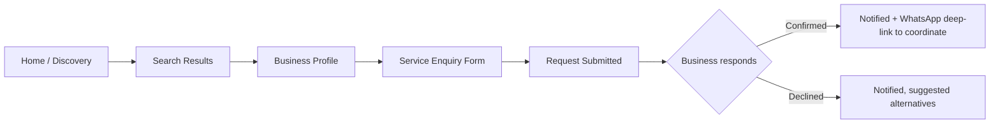
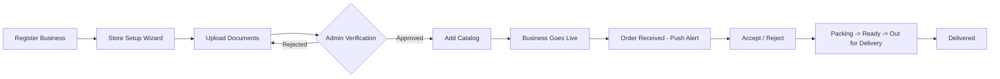

# UI Wireframes

## Hyperlocal Digital Marketplace Platform

| | |
|---|---|
| **Owner** | Arutech Consultancy Services LLP |
| **Status** | Draft v1.0 — pending stakeholder approval |
| **Date** | 2026-07-11 |
| **Phase** | 5 of 10 |
| **Input** | [PRD](../01-product-requirements/PRD.md), [API Design](../04-api-design/API_DESIGN.md) |
| **Companion artifact** | [Wireframe Gallery](wireframe-gallery.html) — 17 low-fidelity screens across all four client apps |
| **Next phase** | Folder Structure |

**Fidelity note:** these are intentionally **low-fidelity, grayscale layout wireframes** — boxes, placeholder text bars, and annotations establishing information hierarchy and interaction points. No colors, no real typography, no branding. That's deliberate: locking visual design (the "premium, modern, no-copied-templates" bar the PRD sets) before the layout/IA is validated tends to produce expensive rework. Real visual design happens in Phase 8, applied on top of these validated layouts using the Shadcn UI + Tailwind design system already fixed in [Architecture](../02-architecture/ARCHITECTURE.md).

---

## Table of Contents

1. [Screen Inventory](#1-screen-inventory)
2. [Core User Flows](#2-core-user-flows)
3. [Layout & Interaction Principles](#3-layout--interaction-principles)
4. [Responsive & Platform Notes](#4-responsive--platform-notes)
5. [Accessibility Notes](#5-accessibility-notes)
6. [Open Questions](#6-open-questions)

---

## 1. Screen Inventory

17 screens selected as the smallest set that covers every persona's critical path end-to-end — not an exhaustive screen-by-screen spec (that's a Phase 8 implementation-time expansion), but enough to validate the whole product's shape before any visual design work starts.

| # | App | Screen | Maps to API |
|---|---|---|---|
| 1 | Customer (native) | Home / Discovery | `GET /businesses`, `GET /business-types` |
| 2 | Customer (native) | Search Results (list + map) | `GET /businesses` |
| 3 | Customer (native) | Business Profile | `GET /businesses/:slug`, `/products`, `/services`, `/reviews` |
| 4 | Customer (native) | Product Detail / Add to Cart | `GET /businesses/:id/products`, `POST /carts/:businessId/items` |
| 5 | Customer (native) | Cart & Checkout | `POST /orders` |
| 6 | Customer (native) | Order Tracking | `GET /orders/:id/track`, realtime `order.status_changed` |
| 7 | Customer (native) | Service Enquiry (Model B) | `POST /service-requests` |
| 8 | Merchant (web) | Store Setup Wizard | `POST /merchant/businesses` |
| 9 | Merchant (web) | Catalog Management | `CRUD /merchant/businesses/:id/products` |
| 10 | Merchant (web) | Order Queue | `GET /merchant/businesses/:id/orders`, `PATCH .../status` |
| 11 | Merchant (web) | Sales Dashboard | `GET /merchant/businesses/:id/analytics/sales` |
| 12 | Admin (web) | Verification Queue | `GET /admin/businesses?filter[verificationStatus]=PENDING` |
| 13 | Admin (web) | Business Management Table | `GET /admin/businesses` |
| 14 | Admin (web) | Admin Overview Dashboard | `GET /admin/analytics/revenue` |
| 15 | Delivery Partner (native) | Order Offer | `GET /delivery-partners/me/offers` |
| 16 | Delivery Partner (native) | Active Delivery | `POST .../pickup`, `.../complete`, realtime `location.updated` |
| 17 | Delivery Partner (native) | Earnings & Wallet | `GET /delivery-partners/me/earnings` |

Public SEO web app screens (business landing pages, category pages) are intentionally not wireframed separately — they're a server-rendered, read-only subset of screens 1–3's content, differing in rendering strategy (SSR/SEO metadata) rather than layout.

---

## 2. Core User Flows

### 2.1 Customer: Discovery → Order (Model A)

### 2.2 Customer: Discovery → Enquiry (Model B)

### 2.3 Merchant: Onboarding → First Order

### 2.4 Delivery Partner: Available → Paid

---

## 3. Layout & Interaction Principles

These carry forward into Phase 8 as binding constraints, not suggestions:

- **One primary action per screen.** Every screen in the gallery has exactly one visually dominant call-to-action (e.g., "Add to Cart," "Accept Order," "Verify Business") — secondary actions are visually subordinate. This is a direct response to the Ramesh/Neha personas in the PRD: low tolerance for ambiguity about what to do next.
- **Status is always visible, never a modal you have to summon.** Order status, delivery-partner availability, business open/closed state — all rendered inline on the screens that need them, not hidden behind a "check status" tap.
- **Merchant/Admin screens are data-dense by design** (tables, queues, dashboards) — these are desk-bound power-user tools, deliberately different information density from the customer app's browse-first layouts. This is the same rationale as the native-vs-web client split in [Architecture §4](../02-architecture/ARCHITECTURE.md#4-client-applications).
- **The order/delivery state machine is rendered as a horizontal stepper everywhere it appears** (customer tracking, merchant queue, delivery app) — one consistent visual pattern for the single most-viewed piece of state in the product, rather than a bespoke treatment per screen.
- **Empty states and loading states are part of the design, not an afterthought** — every list-bearing screen in the gallery includes an annotated empty-state note (e.g., "no businesses found nearby — widen search radius" beats a blank screen).

---

## 4. Responsive & Platform Notes

- **Native apps (Customer, Delivery Partner):** designed mobile-first at a 375×812 (iPhone-standard) reference frame; React Native layout uses Flexbox equivalently across iOS/Android, no platform-specific layout forks planned at MVP.
- **Web apps (Merchant, Admin, Public):** responsive from a 1280px desktop-first baseline down to a 768px tablet breakpoint (the realistic minimum for a merchant managing a catalog) — not optimized for phone-width, consistent with [Architecture §4](../02-architecture/ARCHITECTURE.md#4-client-applications)'s rationale that these are desk-bound tools.
- **Map views** (screen #2, #16) reserve their surface area consistently across list/map toggle states so the toggle doesn't reflow the rest of the page.

---

## 5. Accessibility Notes

Per [PRD §9](../01-product-requirements/PRD.md#9-non-functional-requirements) (WCAG 2.1 AA target for customer-facing web):

- Minimum 44×44px touch targets on all native-app interactive elements (order accept/reject buttons, cart quantity steppers) — annotated directly on the relevant wireframes.
- Status is never conveyed by color alone (a real risk once the grayscale wireframes gain color in Phase 8) — order status stepper and open/closed indicators pair color with a text label and/or icon in every screen that uses them.
- Form screens (Store Setup Wizard, Checkout, Service Enquiry) show inline validation errors adjacent to the field, not only in a summary banner.

---

## 6. Open Questions

None block Phase 6 (Folder Structure). One item for Phase 8:

- **Final visual language** (color palette, typography scale, spacing tokens) is explicitly not decided here — it's a Phase 8 deliverable once Shadcn UI's theming is wired up, and depends on the still-open product-name decision ([PRD §16](../01-product-requirements/PRD.md#16-open-decisions-requiring-stakeholder-input)).

---

**Status:** Ready for review alongside the [Wireframe Gallery](wireframe-gallery.html). Phase 6 (Folder Structure) scaffolds the monorepo these screens will be implemented in.
